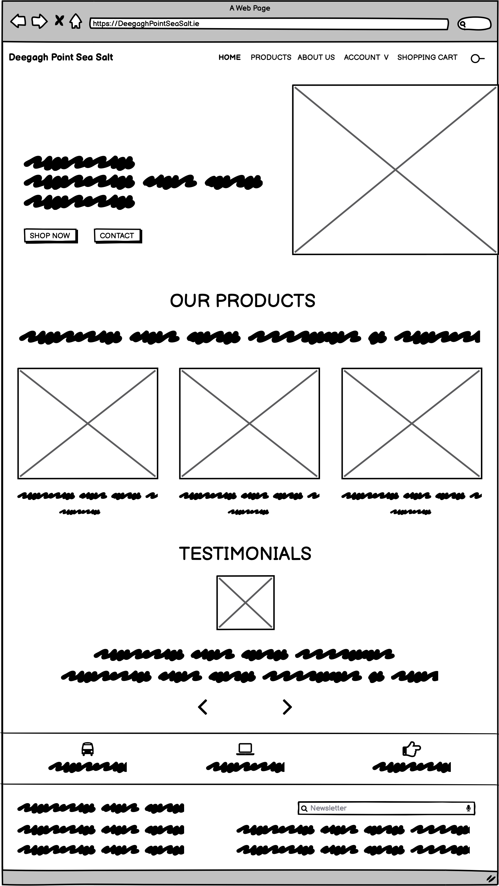
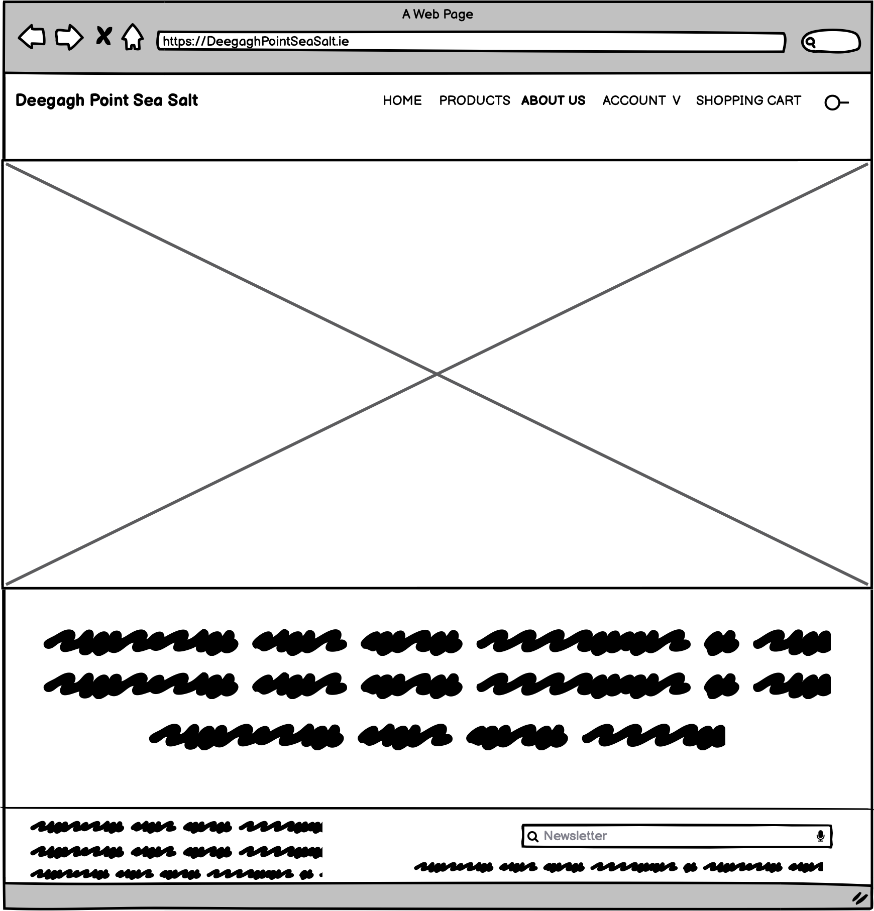
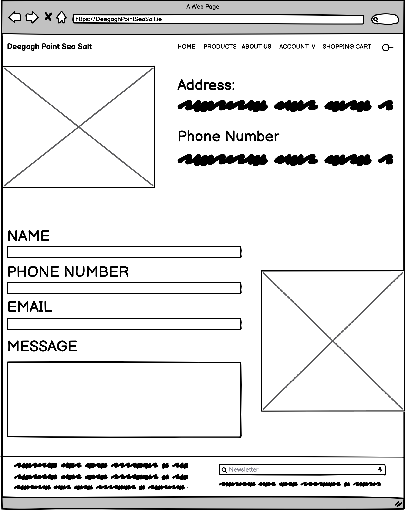
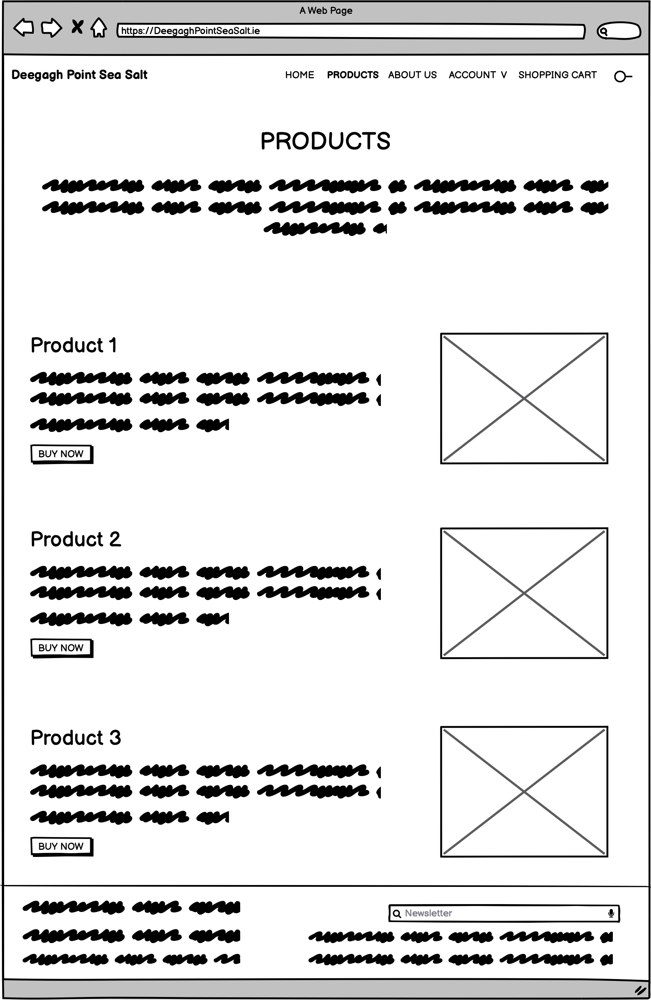

# Deegagh Sea Salt
 

<a href="https://donegal-courts.herokuapp.com/" alt="link to Deegagh Sea Salt" target="_blank" rel="noopener">Link to The Deegagh Sea Salt</a>

 In order to view this project correctly in github, please add the following into the terminal: "pip3 install -r requirements.txt"

## Project Goals 
<ul>
    <li> The main goal of this project is to create a website that site users can buy sea salt from.</li>
    <li>The E-Commerce site will be fully functional and will allow users from all age demographics and tech experience to use the site easily. </li>
</ul>

## Table of Contents
1. [Project Goals](#project-goals)
2. [User Experience](#user-experience)
    1. [Target Audience](#target-audience)
    2. [User Requirements](#user-requirements)
    3. [User Stories](#user-stories)
3. [Technical Design](#technical-design)
    1. [Flow Chart](#flow-chart)
    2. [Database Diagram](#database)
    3. [User Manual](#user-manual)
    4. [Wireframes](#wireframes)
4. [Technology](#technology)
    1. [Develpoment Languages Used & 3rd Party Libraries:](#develpoment-languages-used)
5. [Features](#features)
6. [Testing](#testing)
    1. [Python Validation](#python-validation)
    2. [HTML Validation](#html-validation)
    3. [CSS Validation](#css-validation)
    4. [JavaScript Validation](#javascript-validation)
    5. [Accessibility](#accessibility)
    6. [Performance](#performance)
    7. [Testing user stories](#testing-user-stories)
7. [Bugs](#Bugs)
8. [Deployment](#deployment)
9. [Credits](#credits)
10. [Acknowledgements](#acknowledgements)
11. [Future Features](#future-features)

### User Experience:

### Target Audience 

The Deegagh Sea Salt E-Commerce site has a large target audience as it offers a universal product. However, primarily the users are geared towards tourists visiting Ireland who want to buy souvenirs, chefs who want to buy salt in bulk for their resturants / business, and or those that live in ireland who want to support local. 

### User Requirements

As I have mentioned, the site has a very large target audience. The age demographics are quite broad and because of this the site has to be easy to use for every age group. I have taken the following approach to make sure that all User Requirements to access and use the site has been covered:

<ul>
    <li>Have a clear understanding of the layout of the site -> clear navigation.</li>
    <li>The blog has to be formal and factual, information on the site has to be easily accessibile to the user.</li>
    <li>The option of posting products has to be limited to the admin of the site to prevent scams. A random user of the site can not have permission to post products.</li>
</ul>

### User Stories

### First time and Recurring Stories
<ol>
    <li>As a user of the site, I want to be able to view the products available to buy.</li>
    <li>As a user of the site, I would like to be able to view the products available to buy within categories.</li>
    <li>As a user of the site, I would like to be able to view the products in their categories on the site easily.</li>
    <li>As a site user, I would like to be able to buy a product from the site successfully and easily.</li>
    <li>As a user of the site, I would like to be able to create an account with the possibility of keeping up to date with my order history and tracking.</li>
    <li>As a user, I would like to be able to leave a review on a product I have ordered.</li>
</ol>

### Site's Owner Stories
<ol>
    <li>As a site owner, I would like to display to customers if an item is in stock or not.</li>
    <li>As a site owner, I want to employ web marketing strategies to grow the audience of my site.</li>
    <li>As the owner of the site, I want to be able to upload products to the site using the admin section.</li>
</ol>

## Technical Design

### Flow Chart

 I used the flow chart to design a clear map of my site that would help me design the functionality of the site and the logic and guidence for user stories. I did this by using Lucid Chart

User Flow Chart

        

Admin Flow Chart

        

### Database 

 My Database has eight models:

 My project uses the relational databse -> PostgreSQL.

 The data is handeled within the application with Django. 

<ul>
<li> Comment </li>
<li> Contact </li>
<li> Category </li>
<li> Order </li>
<li> OrderLineItem </li>
<li> Post </li>
<li> Product </li>
<li> UserProfile </li>

</ul>
<ul>
 

 Comment: 

<li> This Comment model will allow users to post comments under the blog post.</li>
<li> It is used by several users to post comments under the blog post, there for it uses a Foreign Key. </li>
<li> It includes the following fields: post, name, body, date_added.</li>
 

 Contact: 

<li> This Contact model will allow me to save the contact forms that are sent to the admin of the site, and store the     details in the admin section of the site so the admin can easily get back to the user trying to get in contact.</li>
<li> It is used by several users to contact the admin of the site, there for it uses a input fields. </li>
<li> It includes the following fields: name, email and message.</li>
 

 Category: 

<li> This Category model will allow me to seperate the products into their respective categories.</li>
<li> It includes the following fields: name, friendly_name.</li>
 

 Order: 

<li> This Order model will allow me to create the order information and organize the information that is recorded in the back end when an order is placed.</li>
<li> It includes the following fields: order, product, product_size, quantity, lineitem_total.</li>
 

 OrderLineItem: 

<li> This OrderLineItem model will allow me to create the order information and organize the information that is recorded in the back end when an order is placed.</li>
<li> It includes the following fields: name, friendly_name.</li>
 

 Post: 

<li> This Post model will allow me to post onto the site, and create the required variables fields.</li>
<li> It is used by the admin to post blog posts to the site, there for it uses a Foreign Key as an ID of the admin/ author. </li>
<li> It includes the following fields: title, title_tag, featured_image, snippet, author, body and post_date.</li>

 Post has a many to manny relationship and also uses the imported User class model for username  to help calculate the likes on each blog post.

 

 Product: 

<li> This Product model will allow me to supply information for each product added to the site via the admin section of the site.</li>
<li> It includes the following fields: sku, name, description, size, price, rating, image.</li>
 

 UserProfile: 

<li> This Userprofile model will allow users to add information to their accounts on the site.</li>
<li> It includes the following fields: user, default_email, default_phone_number, default_street_address1, default_street_address2, default_town_or_city, default_county, default_country, default_postcode.</li>

 UserProfile has a one to one relationship.

 

Database Diagram

        

 

### User Manual:
<ol>
<li>The site admin username is admin (lowercase) and the password is Pass123!.</li> 

<li>The Site is very simple in design - It includes a home section where a user can view the products, their categories, the navbar - holding the bulk of the e-commerce functionality - and a contact section. It also holds a link to the return policy of the site and its Terms and conditions.</li>
<li>The products are very simply laid out on the homepage in their respective categories. Once in the categories the user can scroll through the section in a list formate to view the products avaiable to buy.</li>
    
 -- If the user is the site admin they can edit products and delete products.

<li>The login in section is simple as it is restricted to asking for the username and password. The registration form is also simple and easy to follow. Once logged in the user can view their order history and to leave reviews.</li>
<li> The contact Page allows the user to simply message the admin of the site to get more information or to leave a comment. The address and phone number are also on the page.</li>
<li> The admin mainly uses the Admin section of the site to post products and their descriptions, images of the products and review any messages that have been sent via the contact from.</li>
<li> Interms of e-commerce features, the main ones that users will be able to use is simply adding products to the shopping cart, removing the products from the cart, using stripe as a payemnt method and adding their shipping address.</li>
</ol>

### Wireframes:

Home Page

        

About Us

        

Account

        

Contact Us

        

Products

        

### Technology:

### Develpoment Languages Used

<ul>
<li> Python </li>
<li> HTML </li>
<li> CSS </li>
<li> JavaScript </li>
</ul>

###  Frameworks and Tools used & 3rd Party Libraries:
<ul>
<li> Git, GitHUb, and GitPod </li>
<li> Lucid Chart </li>
<li> Balsamiq - Wireframes </li>
<li> quickdatabasedesign.com </li>
<li> Heroku </li>
<li> Django </li>
<li> BootStrap 5 </li>
<li> Ajax</li>
</ul>

## Features:
<ol>
<li> Clear Apperance and Style </li>
<li> Quick and Correct fucntional search bar </li>
<li> Easy and Simple Website Navigation </li>
<li> Elaborated product descriptions </li>
<li> Companies terms and conditions </li>
<li> Payment Method </li>
<li> Reviews and Testimonials </li>
<li> Fully fucntional shopping cart </li>
<li> Contact Page </li>
<li> Return Policy Section </li>
<li> Products list and specified product descriptions </li>
<li> Account Functionality: login and registration </li>
<li> Shopping Cart: List of products for sale, products in cart, remove products, continue shopping, and payment</li>
</ol>
 

### Features in Detail:
<ul>Clear Apperance and Style:
<li> The site needs to be clean in apperance and style to help with accessibility and Navigation</li>

User Stories Used: N/A

            

</ul>

 
<ul>Quick and Correct Fucntional Search Bar:
<li> As part of the sites, e-commerce functionality, the user needs to be able to have a functional search bar in able to look through and easily find specific products that are of interest to them.</li>

User Stories Used: 1, 2, 3 

            

</ul>

 
<ul>Easy and Simple Website Navigation:
<li> The site needs to be clean in apperance and style to help with accessibility and Navigation. The navigation that the top of the site is fixed, and will allow the user to still see the options for navigation even when scrolling down. </li>

User Stories Used: N/A

            

</ul>

 
<ul>Elaborated Product Descriptions:
<li> The site needs to be clean in apperance and style to help with accessibility and Navigation</li>

User Stories Used:1, 3 

            

</ul>

 
<ul>Companies Terms and Conditions:
<li> The site provides a terms and conditions section for the users to be aware of the T's & C's before buying.</li>

User Stories Used: N/A

            

</ul>

 
<ul>Payment Method:
<li> The site needs to have a functional and usable payment method (Stripe) to allow the users to pay for their items easily.</li>

User Stories Used: 4 

            

</ul>

 
<ul>Reviews and Testimonials:
<li> As users generally rely on reviews to help decide if they should buy a product the site needs to have a testimonal and reviews section for the products.</li>

User Stories Used: 6

            

</ul>

 
<ul>Fully Fucntional Shopping Cart:
<li> The shoppping cart on the site, located in the navbar is equiped with a list of products in the shopping cart, remove button to take the products out of the cart and if the user is happy with their purchase the can go to the payment section and shipping information section.</li>

User Stories Used: 4 

            

</ul>

 
<ul>Contact Page:
<li> Contact us section of site</li>

User Stories Used: 

            

</ul>

 
<ul>Return Policy Section:
<li> A return policiy section to allow the user to be aware of how to return a product if needed.</li>

User Stories Used: 

            

</ul>

 
<ul>Products List and Specified Product Descriptions:
<li> The products available on the site needs to easily show the products available and their specified product description so the user knows what they are buying</li>

User Stories Used: 1, 2, 3 

            

</ul>

 
<ul>Account Functionality: Login and Registration:
<li> The users of the site will have a section where they can register for an account. Once registered the user can see their order history and update their profile for personalisation. The user once signed in will be able to leave a review on the products they have ordered too. Users can't leave a review unless signed in.</li>

User Stories Used: 5, 6

            

</ul>

 
<ul>Shopping Cart: List of Products For Sale, Products in Cart, Remove Products, Continue Shopping, and Payment:
<li> The shoppping cart on the site, located in the navbar is equiped with a list of products in the shopping cart, remove button to take the products out of the cart and if the user is happy with their purchase the can go to the payment section and shipping information section.</li>

User Stories Used: 4 

            

</ul>
 

## Testing:

### Python Validation

 To Validate my Python I used the ExtendsClass Free Online Toolbox for developers (https://extendsclass.com/python-tester.html). All python code passed its Validation with no errors but one warnings as shown below in the pictures.

<h4> Blog (App)</h4>

admin.py

forms.py

models.py

urls.py

views.py

<h4> Members (App)</h4>

forms.py

urls.py

views.py

<h4> Contact (App)</h4>

admin.py

forms.py

urls.py

views.py

models.py

 

### HTML Validation

 To Validate my HTML I used the WC3 Validator. All HTML code passed its Validation with a few errors as documented below. All errors are due to using the django/python framework.

Home Page

Add Comment 

Base

Delete Pose

Update Post

 

Contact

 

Change Password

Edit Profile

Login

Password Success

Register

User Profile

 

### CSS Validation

 To Validate my CSS I used the Jigsaw W3 Validator. All CSS code passed its Validation with no errors or warnings as shown below in the pictures.

CSS Validation

### Accessibility

 To Validate the Accessibility of the site I used the Wave Web Accessibility Validator.

Home page

Contact page

Login page

Register

Post Details

User Profile

Comment Form

Delete Post

Update Post

### Performance

 To Validate the Performance of the site I used the lighthosue tool in the browser'git ps develpoments tools.

Home

Contact page

Login page

Register

Post Details

User Profile

Comment Form

Delete Post

Update Post

### Testing User Stories

    1."As a user of the site, I want to be able to view the products available to buy."
| **Feature** | **Action** | **Expected Result** | **Actual Result** |
|-------------|------------|---------------------|-------------------|
|Home section of blog post site| The user can scroll through the content uploaded by the site admin| The user can browse through the content on the site| Works as expected|

User Testing 1

    2."As a user of the site, I would like to be able to view the products available to buy within categories."
| **Feature** | **Action** | **Expected Result** | **Actual Result** |
|-------------|------------|---------------------|-------------------|
|Home section of blog post site| The user can scroll through the content uploaded by the site admin and read the court news stories| The user can browse through the content on the site| Works as expected|

User Testing 2

    3."As a user of the site, I would like to be able to view the products in their categories on the site easily."
| **Feature** | **Action** | **Expected Result** | **Actual Result** |
|-------------|------------|---------------------|-------------------|
|Home section of blog post site| The user can scroll through the content uploaded by the site admin. The blog posts are shown in a list formate| The user can browse through the content on the site| Works as expected|

User Testing 3

    4."As a site user, I would like to be able to buy a product from the site successfully and easily."
| **Feature** | **Action** | **Expected Result** | **Actual Result** |
|-------------|------------|---------------------|-------------------|
|Detailed blog post section of the site| The user can read the blog post stories once they have navigated into a story the want to read.| The user can read the post on the site| Works as expected|

User Testing 4

    5."As a user of the site, I would like to be able to create an account with the possibility of keeping up to date with my order history and tracking."
| **Feature** | **Action** | **Expected Result** | **Actual Result** |
|-------------|------------|---------------------|-------------------|
|Comments section under blog post| The user can read comments left by other users that have visited the site| The user can read the comments for posts on the site| Works as expected|

User Testing 5

    6."As a user, I would like to be able to leave a review on a product I have ordered."
| **Feature** | **Action** | **Expected Result** | **Actual Result** |
|-------------|------------|---------------------|-------------------|
|Comments section under blog post| The user can create and post comments under the blog posts| The user can create the comments for posts on the site| Works as expected|

User Testing 6

   7."As a user of the site, I would like to view the products available to buy in a gallery as well as categorised."
| **Feature** | **Action** | **Expected Result** | **Actual Result** |
|-------------|------------|---------------------|-------------------|
|Register Section in Nav Bar| The user can create an account with the site| The user can create their account and leave comments if wanted | Works as expected|

User Testing 7

### Testing Site Owner's Stories

    1."As a site owner, I would like to display to customers if an item is in stock or not."
| **Feature** | **Action** | **Expected Result** | **Actual Result** |
|-------------|------------|---------------------|-------------------|
|Django admin section| The admin can create blog post to be displayed in the site| The admin can create a blog post in their admin section to be displayed on the site | Works as expected|

User Testing 8

    2."As a site owner, I want to employ web marketing strategies to grow the audience of my site."
| **Feature** | **Action** | **Expected Result** | **Actual Result** |
|-------------|------------|---------------------|-------------------|
|Django admin section| The admin can create blog post to be displayed in the site. If the user doesn't want to post the blog post right away they can save it as a draft and come back to it| The admin can create a blog post in their admin section and save it as a draft | Works as expected|

User Testing 9

    3."As the owner of the site, I want to be able to upload products to the site using the admin section."
| **Feature** | **Action** | **Expected Result** | **Actual Result** |
|-------------|------------|---------------------|-------------------|
|Django admin section| The admin can create a blog post, delete a blog post, post comments and delete comments on posts to be displayed in the site.| The admin can create a blog post, delete a blog post, post comments and delete comments in their admin section | Works as expected|

User Testing 10

## Bugs:

| **Bug** | **Fix** |

 I couldn't get my django messaging to work and therefore tried to create a backup messaging service using Ajax. I called tutors, looked for hours on google, stackover flow and youtube and I just couldn't figure out on time why my messages weren't working. Below is a list of resources I used to try and figure out the error.

<ul>
<li>https://ordinarycoders.com/blog/article/extend-and-include-django-template-tags</li>
<li>https://docs.djangoproject.com/en/4.0/ref/contrib/messages/</li>
<li>https://www.javatpoint.com/django-form-validation</li>
<li>https://www.youtube.com/watch?v=Mf_97YaUKag</li>
</ul>

 When talking to tutor support they suggest the following which I tried with no success:

<ul>
<li>Suggestion 1: Make use of the Google console - I can see that there is an error coming from the js, so i would recommend you make more use of these tools to help improve your debugging skills and get you through this issue.
</li>
<li>
Suggestion 2: Double check that the bootstrap version is not causing issues with the js functionality - this is a very common thing to see. You may want to check the exact version used in the walkthrough, or do some further research into how to apply messages for your specific bootstrap version.
</li>
<li>
Suggestion 3: Run through the course materials again and use diffchecker to check the source code versus your own to highlight any obvious errors.
</li>
<li>
With this in mind, we recommend:
 -  Recommendation 1: Reviewing the following lessons and resources, which are directly applicable to the code you are currently working on:
 - Recommendation 2: If you are stuck overall, chat to your mentor, and come up with a clear plan (a set of concise steps which you feel comfortable implementing) which will achieve a passing grade, and work on that.
 - Recommendation 3: Google is a programmer’s best friend. Everybody gets stuck at some point when coding, and the first thing they do is turn to Google. If you’re struggling with a particular piece of functionality or don’t understand what a particular line of code does, try Googling it! Every built-in function has extensive documentation available online. For example, W3Schools contains detailed explanations on every piece of HTML, CSS, JavaScript, and Python code you could think of. For example, here’s their doc for the JavaScript Array.indexOf() function: https://www.w3schools.com/jsref/jsref_indexof_array.asp They provide working code examples, descriptions of the function, and information about similar functions!
</li>

 I am stuck tryin to fix this at them moment, I have tried the tutors recommendations but with no luck. I think I would try restart the page and see if there was a deeper issue in the page I can't see at the moment, I have just ran out of time.

 
|
 The other bug is the comment form, the comment posts to the site fine, the validation just doesn't work or prompt the user.
 | 
 Just like the previous bug I would have to figure out why my form validation isn't working. I would re-write the comment form in this case though.

 I managed to get form validation on the contact form. I had to re-write the messages section in the base.html and add a message.addmessage to the views.py

Contact Form Validation

</ul>

## Deployment:

### Deploying to Heroku (Automatic)

<ul> 
<li> Use pip3 freeze > requirements.txt in terminal to save libraries that need to be installed on Heroku as well.</li>
<li> Create Procfile and add web: gunicorn blog.wsgi.</li>
<li> Log in to Heroku.</li>
<li> Click on the new button in the top right corner and in the drop down menu choose Create New App.</li>
<li> Choose a name for your app and a region and then click Create App.</li>
<li> Go to the resources tab and go to add-ons, search for postgres and ass heroku postgres.</li>
<li> Go to the settings tab and go to Config Vars, click Reveal Config Vars and copy the DATABASE_URL_VALUE. Add DATABASE_URL and Value to the env.py in the code.</li>
<li> Add SECRET_KEY and VALUE to Config Vars and add to the env.py in code.</li>
<li> Add DATABSES in settings.py to fork with heroku database.</li>
<li> Write python3 manage.py migrate in terminal.</li>
<li> Add url in settings.py on ALLOWED_HOSTS.</li>
<li> Go to the deploy tab and pick GitHub as deployment method.</li>
<li> Search for a repository and connect to it.</li>
<li> Click the button enable automatic deploys and the button deploy branch.</li>
<li> Wait for the app to build and then click the rview button.</li>
</ul>
 

### Deploying to Heroku (Manual CLI)
<ul>

 In Gitpod terminal; 

<li>enter in 'heroku login -i'</li>
<li> Then enter 'heroku apps</li>
<li> Set the heroku remote > enter into the terminal 'heroku git:remote -a 'your app name'</li>
<li> git add . and git commit -m </li>
<li> git push origin main </li>
<li> git push heroku main </li>
</ul>

### Forking a Repository

<ol> 
<li> Log into Github. </li>
<li> Find the Repository you wish to fork.</li>
<li> In the top right corner click the fork button. </li>
<li> Now you will have a copy of the repository in your account! </li>
</ol>
 

### Cloning a Repository

<ol> 
<li> Log into Github. </li>
<li> Find the Repository you wish to clone.</li>
<li> Above the file window locate the green code button and click it. </li>
<li> To clone the repository using https copy the link. </li>
<li> Open Git Bash. </li>
<li> Change the current directory to where you wnat the repository cloned. </li>
<li> In your terminal type now type "Git Clone" followed by the repository you copied. </li>
<li> Press Enter.</li>
</ol>

 

## Credits:
### Source Code Used in Site

 Due to limitations in my knowledge I used youtube tutorials/ stack overflow articles to guide me with creating the blog:

<ul>
<li></li>
</ul>
 

 Images used on the site:.

<ul>
<li>Photo by Moose Photos: https://www.pexels.com/photo/woman-wearing-pink-collared-half-sleeved-top-1036623/</li>

 

## Acknowledgements:

 I would like to take this oppurtuinity to thank and acknowlege the following people:
<ul>
<li> I would like to thank Mo Shami - my mentor - for his feedback and guidence whilst creating the project.</li>
<li> I would like to thank those on the code institute slack channel for help with any issues I had.</li>
<li> I would also like to thank Conor lawton who helped me with understanding some of the code.</li>
</ul>

## Future Features

In future, I would like to add a section where users could view a list of solicitors and barristers in the area that could help them if they needed legal advice.
