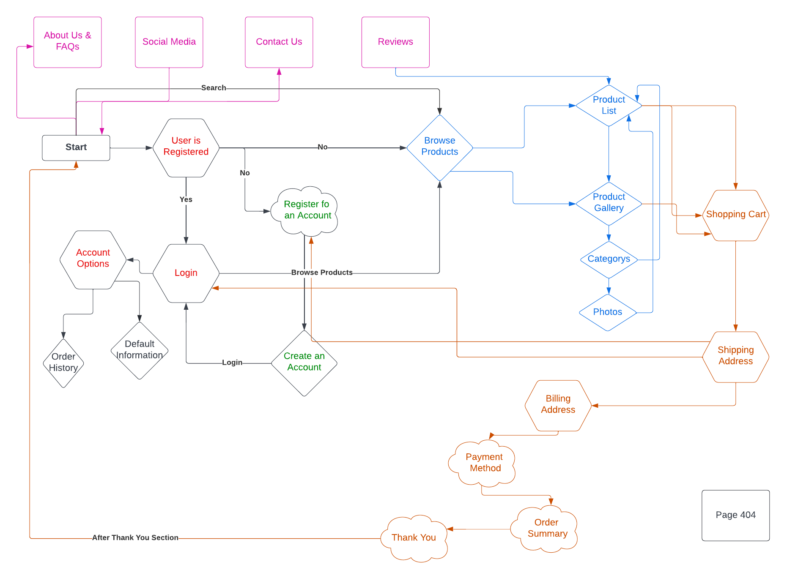
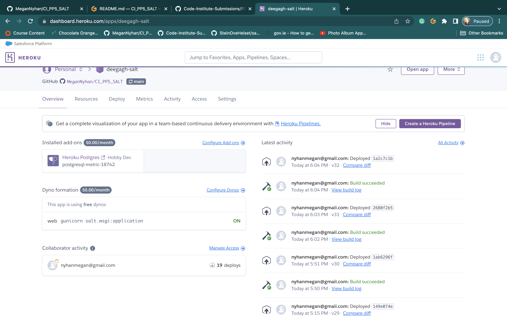

# Deegagh Sea Salt
 

<a href="https://deegagh-salt.herokuapp.com/" alt="link to Deegagh Sea Salt" target="_blank" rel="noopener">Link to The Deegagh Sea Salt</a>

 In order to view this project correctly in github, please add the following into the terminal: "pip3 install -r requirements.txt"

## Project Goals 
<ul>
    <li> The main goal of this project is to create a website that site users can buy sea salt from.</li>
    <li>The E-Commerce site will be fully functional and will allow users from all age demographics and tech experience to use the site easily. </li>
</ul>

## Table of Contents
1. [Project Goals](#project-goals)
2. [User Experience](#user-experience)
    1. [Target Audience](#target-audience)
    2. [User Requirements](#user-requirements)
    3. [User Stories](#user-stories)
    4. [Design Choices](#design-choices)
3. [Technical Design](#technical-design)
    1. [Flow Chart](#flow-chart)
    2. [Business Model](#business-model)
    3. [Database Diagram](#database)
    4. [User Manual](#user-manual)
    5. [Wireframes](#wireframes)
4. [Technology](#technology)
    1. [Develpoment Languages Used & 3rd Party Libraries:](#develpoment-languages-used)
5. [Features](#features)
6. [Testing](#testing)
    1. [Python Validation](#python-validation)
    2. [HTML Validation](#html-validation)
    3. [CSS Validation](#css-validation)
    4. [JavaScript Validation](#javascript-validation)
    5. [Accessibility](#accessibility)
    6. [Performance](#performance)
    7. [Testing user stories](#testing-user-stories)
7. [Marketing Strategy](#marketing-strategy)
8. [Bugs](#Bugs)
9. [Deployment](#deployment)
10. [Credits](#credits)
11. [Acknowledgements](#acknowledgements)
12. [Future Features](#future-features)

### User Experience:

### Target Audience 

The Deegagh Sea Salt E-Commerce site has a large target audience as it offers a universal product. However, primarily the users are geared towards tourists visiting Ireland who want to buy souvenirs, chefs who want to buy salt in bulk for their resturants / business, and or those that live in ireland who want to support local. 

### User Requirements

As I have mentioned, the site has a very large target audience. The age demographics are quite broad and because of this the site has to be easy to use for every age group. I have taken the following approach to make sure that all User Requirements to access and use the site has been covered:

<ul>
    <li>Have a clear understanding of the layout of the site -> clear navigation.</li>
    <li>The blog has to be formal and factual, information on the site has to be easily accessibile to the user.</li>
    <li>The option of posting products has to be limited to the admin of the site to prevent scams. A random user of the site can not have permission to post products.</li>
</ul>

### User Stories

### First time and Recurring Stories
<ol>
    <li>As a user of the site, I want to be able to view the products available to buy.</li>
    <li>As a user of the site, I would like to be able to view the products available to buy within categories.</li>
    <li>As a user of the site, I would like to be able to view the products in their categories on the site easily.</li>
    <li>As a site user, I would like to be able to buy a product from the site successfully and easily.</li>
    <li>As a user of the site, I would like to be able to create an account with the possibility of keeping up to date with my order history and tracking.</li>
    <li>As a user, I would like to be able to leave a review on a product I have ordered.</li>
</ol>

### Site's Owner Stories
<ol>
    <li>As a site owner, I would like to display to customers if an item is in stock or not.</li>
    <li>As a site owner, I want to employ web marketing strategies to grow the audience of my site.</li>
    <li>As the owner of the site, I want to be able to upload products to the site using the admin section.</li>
</ol>

### UX Design: Scope:

The Minimum Viable Product needs to include features that allow the user to know the following:

<li>Home page that acts as staring point and welcome page for the site.</li>
<li>A main navigation menu where, along with a footer, gives access to the main parts of the website, including registration and sign-in for users. The footer includes FAQs and Contact link, and social networks.</li>
<li>Images and the products with their associated price for purchasing.</li>
<li>A method to pay the products, specifically stripe.</li>
<li>A database that accounts for all the data in the website and allows interaction of the users with the products (purchase) and their accounts.</li>
 

### UX Design: Strategy:

To develop an e-commerce website (product) that makes purchasing of geophysical data simple and intuitive. 

 

### UX Design: Structure:

The information is structured as follows:

<li> Home page that acts as staring point and welcome page for the site. </li>
<li> Navigation bar which gives you easy access through the site. </li>
<li> A products section that views and displays the products available to buy. </li>
<li> A product description page, giving the option to the user to buy the product or changes its quantitiy.</li>
<li> A shopping cart that holds the information that the user wants to buy.</li>
<li> A checkout page showing the products the user is about to buy, with the final price to pay, linking with the payment method (Stripe). </li>
<li> Footer, showing the main structure of the website and giving access to the social networks of the e-commerce and a field for the user to contact the shop, and general FAQs and T's & C's. </li>
<li> A profile page, including the option to show the purchase history of the user. </li>
<li> Contact form page. </li>
<li> Pop-up messages informing the interaction of the user with the website (purchase, sign in, sign up, errors and success messages as the main ones). </li>
<li> Sign in, and Register Page. </li>
</ul>
 

### UX Design: Skeleton:

The information and products are accessed through a fixed navigation menu on top of the pages and a footer. The body holds the information specified by the title selected in the nav bar.

 

### UX Design: Surface:

 The website is based on a contrast of different tonalities of black for the header and footer, fonts in strong black and a white for body, separating the fixed navigation menu, the body and the footer.

 

## Design Choices:

 The website is designed to be responsive to cover all screen sizes. 

 

 Colours:

 Colours are beased on a modern e-commerce website, so taking advantage of white and black (balck fixed navigation menu) and balck footer, contrasting with a white background for the body (where products and all other content appear). 

 

 Structure:

<li>The website consists of a header with fixed navigation menu on top, a body and a footer. It is designed to navigate the e-commerce from the header and footer, having them always available.</li>
 

<li>The metadata in the head tag of the base HTML includes the following keywords to help search engines to find the website: .</li>
 

<li>The metadata also includes the following description: " ".</li>
 

<li>Wireframes were developed at the beginning of the project to have a first structure of the e-commerce site.</li>
 

## Technical Design

### Flow Chart

 I used the flow chart to design a clear map of my site that would help me design the functionality of the site and the logic and guidence for user stories. I did this by using Lucid Chart

User Flow Chart

        

Admin Flow Chart

        

### Business Model:

The e-commerce business model surrounding the site is designed in such a way that a "user" (who is uniquely identified by an ID) can buy "products" (that are also uniquely identified by an ID and SKU) by requesting an "order" (that is uniquely identified by an ID and individual order number). Then, as an order can have numerous products, and simultaneously a product can be requested by numerous orders, an "order-line-item" is created to uniquely tie a specific product to a specific order. This "order-line-item" divides the many-to-many relation between "order" and "product" in two one-to-many relations ("order-order-line-item" and "order-line-item-product"). "Product reviews" can be added (related) to each product. One-to-many communication is open between the "user" and the business through the contact form that the admin of the site can access through the admin panel.

### Database 

 My Database has eight models:

 My project uses the relational databse -> PostgreSQL.

 The data is handeled within the application with Django. 

<ul>
<li> Contact </li>
<li> Category </li>
<li><strong> Description (custom)</strong></li>
<li><strong>Introduction (custom)</strong></li>
<li> Order </li>
<li> OrderLineItem </li>
<li><strong>Photo (custom)</strong></li>
<li> Post </li>
<li> Product </li>
<li><strong>Review (custom)</strong></li>
<li> UserProfile </li>

</ul>
<ul>
 

 Contact: 

<li> This Contact model will allow me to save the contact forms that are sent to the admin of the site, and store the     details in the admin section of the site so the admin can easily get back to the user trying to get in contact.</li>
<li> It is used by several users to contact the admin of the site, there for it uses a input fields. </li>
<li> It includes the following fields: name, email and message.</li>
 

 Category: 

<li> This Category model will allow me to seperate the products into their respective categories.</li>
<li> It includes the following fields: name, friendly_name.</li>
 

 Description (custom model): 

<li> This allowed me to add a category to the photos shown in the gallery in the site.</li>
<li> It includes the following fields: name</li>
 

 Introduction (custom model): 

<li> This gives the admin of the site the opition of changing the Introduction of the site in the main header of the index page.</li>
<li> It includes the following fields: Head, Body</li>
 

 Order: 

<li> This Order model will allow me to create the order information and organize the information that is recorded in the back end when an order is placed.</li>
<li> It includes the following fields: order, product, product_size, quantity, lineitem_total.</li>
 

 OrderLineItem: 

<li> This OrderLineItem model will allow me to create the order information and organize the information that is recorded in the back end when an order is placed.</li>
<li> It includes the following fields: name, friendly_name.</li>
 

 Photo (custom model): 

<li> This allows the admin to add photos to the gallery section of the site and to also section the salt into categorys.</li>
<li> It includes the following fields: image, category.</li>
 

 Post: 

<li> This Post model will allow me to post onto the site, and create the required variables fields.</li>
<li> It is used by the admin to post blog posts to the site, there for it uses a Foreign Key as an ID of the admin/ author. </li>
<li> It includes the following fields: title, title_tag, featured_image, snippet, author, body and post_date.</li>

 Post has a many to manny relationship and also uses the imported User class model for username  to help calculate the likes on each blog post.

 

 Product: 

<li> This Product model will allow me to supply information for each product added to the site via the admin section of the site.</li>
<li> It includes the following fields: sku, name, description, size, price, rating, image.</li>
 

 Review (custom model): 

<li> This Comment model will allow users to post comments under the blog post.</li>
<li> It is used by several users to post comments under the blog post, there for it uses a Foreign Key. </li>
<li> It includes the following fields: post, name, body, date_added.</li>
 

 UserProfile: 

<li> This Userprofile model will allow users to add information to their accounts on the site.</li>
<li> It includes the following fields: user, default_email, default_phone_number, default_street_address1, default_street_address2, default_town_or_city, default_county, default_country, default_postcode.</li>

 UserProfile has a one to one relationship.

 

Database Diagram

        

 

### User Manual:
<ol>
<li>The site admin username is admin (lowercase) and the password is Pass123!.</li> 

<li>The Site is very simple in design - It includes a home section, - that has a section in the nav bar where a user can view the products, their categories - holding the bulk of the e-commerce functionality - and a contact section. It also holds a link to the testimonials, about us and FAQs link.</li>
<li>The products are very simply laid out on the homepage in their respective categories. Once clicked in the categories the user can scroll through the section in a list formate to view the products avaiable to buy.</li>
    
 -- If the user is the site admin they can edit products and delete products in the admin section.

<li>The login in section is simple as it is restricted to asking for the username and password. The registration form is also simple and easy to follow. Once logged in the user can view their order history and to update their delivery and personal information.</li>
<li> The recipes section of the site is to allow users to view recipes they can use their newly bought products in.</li>
<li> The contact Page allows the user to simply message the admin of the site to get more information or to leave a comment. The address and phone number are also on the page.</li>
<li> The admin mainly uses the Admin section of the site to post products and their descriptions, images of the products and review any messages that have been sent via the contact from.</li>
<li> Interms of e-commerce features, the main ones that users will be able to use is simply adding products to the shopping cart, removing the products from the cart, using stripe as a payemnt method and adding their shipping address.</li>
</ol>

### Wireframes:

Home Page

        

Recipes

        

Products

        

Product Detail

        

Login

        

Register

        

Shopping Cart

        

Checkout

        

Checkout_Success

        

User Profile

        

### Technology:

### Develpoment Languages Used

<ul>
<li> Python </li>
<li> HTML </li>
<li> CSS </li>
<li> JavaScript </li>
</ul>

###  Frameworks and Tools used & 3rd Party Libraries:
<ul>
<li> jQuery </li>
<li> Stripe  </li>
<li> Git, GitHUb, and GitPod </li>
<li> Lucid Chart </li>
<li> Balsamiq - Wireframes </li>
<li> quickdatabasedesign.com </li>
<li> Heroku </li>
<li> Django </li>
<li> BootStrap 5 </li>
<li> Ajax</li>
<li> Font Awesome </li>
<li> Favicon </li>
<li> Cloudinary </li>
</ul>

## Features:
<ol>
<li> Clear Apperance and Style </li>
<li> Quick and Correct fucntional search bar </li>
<li> Easy and Simple Website Navigation </li>
<li> Elaborated product descriptions </li>
<li> Recipes section </li>
<li> Companies terms and conditions </li>
<li> Payment Method </li>
<li> Reviews and Testimonials </li>
<li> Fully fucntional shopping cart </li>
<li> Contact Page </li>
<li> Return Policy Section </li>
<li> Products list and specified product descriptions </li>
<li> Account Functionality: login and registration </li>
<li> Shopping Cart: List of products for sale, products in cart, remove products, continue shopping, and payment</li>
</ol>
 

### Features in Detail:
<ul>Clear Apperance and Style:
<li> The site needs to be clean in apperance and style to help with accessibility and Navigation</li>

User Stories Used: N/A

            

</ul>

 
<ul>Quick and Correct Fucntional Search Bar:
<li> As part of the sites e-commerce functionality, the user needs to be able to have a functional search bar in able to look through and easily find specific products that are of interest to them.</li>

User Stories Used: 1, 2, 3 

            

</ul>

 
<ul>Easy and Simple Website Navigation:
<li> The site needs to be clean in apperance and style to help with accessibility and Navigation. The navigation that the top of the site is fixed, and will allow the user to still see the options for navigation even when scrolling down. </li>

User Stories Used: N/A

            

</ul>

 
<ul>Elaborated Product Descriptions:
<li> The site needs to be clean in apperance and style to help with accessibility and Navigation</li>

User Stories Used:1, 3 

            

</ul>

 
<ul>Recipes Section:
<li> The recipes is a section for users to see how they can use the products that they have bought in different dishes to bake or cook.</li>

User Stories Used: N/A 

            

</ul>

 
<ul>Companies Terms and Conditions:
<li> The site provides a terms and conditions section for the users to be aware of the T's & C's before buying.</li>

User Stories Used: N/A

            

</ul>

 
<ul>Payment Method:
<li> The site needs to have a functional and usable payment method (Stripe) to allow the users to pay for their items easily.</li>

User Stories Used: 4 

            

</ul>

 
<ul>Reviews and Testimonials:
<li> As users generally rely on reviews to help decide if they should buy a product the site needs to have a testimonal and reviews section for the products.</li>

User Stories Used: 6

            

</ul>

 
<ul>Fully Fucntional Shopping Cart:
<li> The shoppping cart on the site, located in the navbar is equiped with a list of products in the shopping cart, remove button to take the products out of the cart and if the user is happy with their purchase the can go to the payment section and shipping information section.</li>

User Stories Used: 4 

            

</ul>

 
<ul>Contact Page:
<li> Contact us section of site</li>

User Stories Used: 

            

</ul>

 
<ul>Return Policy Section:
<li> A return policiy section to allow the user to be aware of how to return a product if needed.</li>

User Stories Used: 

            

</ul>

 
<ul>Products List and Specified Product Descriptions:
<li> The products available on the site needs to easily show the products available and their specified product description so the user knows what they are buying</li>

User Stories Used: 1, 2, 3 

            

</ul>

 
<ul>Account Functionality: Login and Registration:
<li> The users of the site will have a section where they can register for an account. Once registered the user can see their order history and update their profile for personalisation. The user once signed in will be able to leave a review on the products they have ordered too. Users can't leave a review unless signed in.</li>

User Stories Used: 5, 6

            

</ul>

 
<ul>Shopping Cart: List of Products For Sale, Products in Cart, Remove Products, Continue Shopping, and Payment:
<li> The shoppping cart on the site, located in the navbar is equiped with a list of products in the shopping cart, remove button to take the products out of the cart and if the user is happy with their purchase the can go to the payment section and shipping information section.</li>

User Stories Used: 4 

            

</ul>
 

## Testing:

### Python Validation

 To Validate my Python I used the ExtendsClass Free Online Toolbox for developers (https://extendsclass.com/python-tester.html). All python code passed its Validation with no errors but one warnings as shown below in the pictures.

<h4> Blog (App)</h4>

admin.py

forms.py

models.py

urls.py

views.py

<h4> Members (App)</h4>

forms.py

urls.py

views.py

<h4> Contact (App)</h4>

admin.py

forms.py

urls.py

views.py

models.py

 

### HTML Validation

 To Validate my HTML I used the WC3 Validator. All HTML code passed its Validation with a few errors as documented below. All errors are due to using the django/python framework.

Home Page

Add Comment 

Base

Delete Pose

Update Post

 

Contact

 

Change Password

Edit Profile

Login

Password Success

Register

User Profile

 

### CSS Validation

 To Validate my CSS I used the Jigsaw W3 Validator. All CSS code passed its Validation with no errors or warnings as shown below in the pictures.

CSS Validation

### Accessibility

 To Validate the Accessibility of the site I used the Wave Web Accessibility Validator.

Home page

Contact page

Login page

Register

Post Details

User Profile

Comment Form

Delete Post

Update Post

### Performance

 To Validate the Performance of the site I used the lighthosue tool in the browser'git ps develpoments tools.

Home

Contact page

Login page

Register

Post Details

User Profile

Comment Form

Delete Post

Update Post

### Testing User Stories

 

### SEO Analysis

The search engine optimization is focused on Google search engine as it is the most popular search engine amongst users of the internet and persumably my target audience.

SEO, which stands for search engine optimization is defined as, "Search engine optimization is the process of improving the quality and quantity of website traffic to a website or a web page from search engines. SEO targets unpaid traffic rather than direct traffic or paid traffic."- Wikepedia

The aim is to have your site at the top of the search results that refers to the type of site you own.For example I have a e-commerce site selling Donegal Sea Salt, I would aim to have that category show my site at the top of the search results list in google. You do this through using short tail - short tail keywords 1 or 2 words in length, then long tail keywordswhich are more words.

(Info from August 5th, 2022)

| Keywords | Results  (from Google.com) | Content, general description (searching in Google.com) | "Quality"||
| ---- | ---- | ---- | ---- | ---- |
| Keywords                      | Results (from Google.com)  | Content, general description (searching in Google.com)                                           | "Quality" ||
| Sea Salt | 749,000,000 | First results are for E-Commerce sites | Competitive and used alot|
| Salt | 4,600,000,000 | This word brings up mostly results for pages that are about salt, eg. recipes and NHS articles| Too broad|
| Organic Salt | 456,000,000 | First results are for wikepedia pages and salt information sites | To Vague|
| Irish Food |  73,500,000 | Mostly recipes are shown here | Not E-commerce specific enough |
| Irish Souveniers| 6,080,000 | This search shows you were to get souviners local to you | Not food specific |
| Gifts | 7,380,000,000 | Gift ideas sites come up here | Too broad|
| Donegal Gifts | 1,920,000 | Shows you were to get gifts from Donegal | Not food specific enough |
| Home-Grown | 2,330,000,000  | Shows the definition of the word and the clubs you can join | Too broad |
| Local |  2,330,000,000 | Shows the definitions of the words| Too broad|
| Organic Donegal Sea Salt | 932,000 | Shows E-commerce sites right away | Good results for e-commerce sites|
| Locally Made Sea Salt | 92,600,000 | Shows E-commerce sites right away | geared more towards international sales|
| Deegagh Sea Salt | 407,000 | Looks like more names of Aurthors show instead of sea salt products | Too specific |
| Family Run Business |  2,780,000,000 | The definition is the first to come up with no mention of a business until the third page | Too broad| 
| Irish Sea Salt | 21,600,000 | E-commerce sites are the first to come up | Achill Island a competitor is first on list - but I think it would work - Good |
| Artisan Salt | 32,200,000 | Artisan Salt company are the first result here | Maybe too specific again|
| Home Grown Sea Salt | 93,600,000 | Fistly populated but how to make sea salt sites | The third result is a company making sea salt so i think this is hopeful|
| Plain Salt| 268,000,000 | Information on the differnece between table salt and plain salt| Not specific to ecommerce enough|
| Flavoured Salt | 29,500,000 | Information on the different flaboured salt| Not specific to ecommerce enough|
| Himalayan Salt | 25,800,000 | Benefits in Himalyan sea salt | No specific to ecommerce enough|
| Organic Sea Salt | 68,800,000 | Shops like tesco come up first | I think this is a good one

 

    
SEO Site Checkup

    

Also I looked at other sites like Wordstream to look at what other sites recommened: https://tools.wordstream.com/fkt?website=https%3A%2F%2Fdeegagh-salt.herokuapp.com%2F
 

Finally, I included the sitemap.xml (in the root folder) to increase the chances of a higher rank in search engines and help them on finding relevant content, and a robots.txt that discourages spiders from navigating to sections of the site.

sitemap.xml: created using XML-Sitemaps.com
robots.txt: tested with https://support.google.com/webmasters/answer/6062598?hl=en

    
wordtracker.com analysis for "Irish Sea Salt" keyword

        

 

### Organic Growth with Social Media (Facebook)

Like a lot of e-commerce platforms I have used social media and email marketing to market to my target audience. As I am not paying for adds on these sites, I relied on organic traction for my page, posts.
<a href="https://www.facebook.com/profile.php?id=100084226000011" target="_blank"> Deegagh Sea Salt Facbook Page </a>

    
Deegagh Sea Salt Facebook Page

 

 

### Testing User Stories

    1."As a user of the site, I want to be able to view the products available to buy."
| **Feature** | **Action** | **Expected Result** | **Actual Result** |
|-------------|------------|---------------------|-------------------|
|Home section of blog post site| The user can scroll through the content uploaded by the site admin| The user can browse through the content on the site| Works as expected|

User Testing 1

    2."As a user of the site, I would like to be able to view the products available to buy within categories."
| **Feature** | **Action** | **Expected Result** | **Actual Result** |
|-------------|------------|---------------------|-------------------|
|Home section of blog post site| The user can scroll through the content uploaded by the site admin and read the court news stories| The user can browse through the content on the site| Works as expected|

User Testing 2

    3."As a user of the site, I would like to be able to view the products in their categories on the site easily."
| **Feature** | **Action** | **Expected Result** | **Actual Result** |
|-------------|------------|---------------------|-------------------|
|Home section of blog post site| The user can scroll through the content uploaded by the site admin. The blog posts are shown in a list formate| The user can browse through the content on the site| Works as expected|

User Testing 3

    4."As a site user, I would like to be able to buy a product from the site successfully and easily."
| **Feature** | **Action** | **Expected Result** | **Actual Result** |
|-------------|------------|---------------------|-------------------|
|Detailed blog post section of the site| The user can read the blog post stories once they have navigated into a story the want to read.| The user can read the post on the site| Works as expected|

User Testing 4

    5."As a user of the site, I would like to be able to create an account with the possibility of keeping up to date with my order history and tracking."
| **Feature** | **Action** | **Expected Result** | **Actual Result** |
|-------------|------------|---------------------|-------------------|
|Comments section under blog post| The user can read comments left by other users that have visited the site| The user can read the comments for posts on the site| Works as expected|

User Testing 5

    6."As a user, I would like to be able to leave a review on a product I have ordered."
| **Feature** | **Action** | **Expected Result** | **Actual Result** |
|-------------|------------|---------------------|-------------------|
|Comments section under blog post| The user can create and post comments under the blog posts| The user can create the comments for posts on the site| Works as expected|

User Testing 6

   7."As a user of the site, I would like to view the products available to buy in a gallery as well as categorised."
| **Feature** | **Action** | **Expected Result** | **Actual Result** |
|-------------|------------|---------------------|-------------------|
|Register Section in Nav Bar| The user can create an account with the site| The user can create their account and leave comments if wanted | Works as expected|

User Testing 7

### Testing Site Owner's Stories

    1."As a site owner, I would like to display to customers if an item is in stock or not."
| **Feature** | **Action** | **Expected Result** | **Actual Result** |
|-------------|------------|---------------------|-------------------|
|Django admin section| The admin can create blog post to be displayed in the site| The admin can create a blog post in their admin section to be displayed on the site | Works as expected|

User Testing 8

    2."As a site owner, I want to employ web marketing strategies to grow the audience of my site."
| **Feature** | **Action** | **Expected Result** | **Actual Result** |
|-------------|------------|---------------------|-------------------|
|Django admin section| The admin can create blog post to be displayed in the site. If the user doesn't want to post the blog post right away they can save it as a draft and come back to it| The admin can create a blog post in their admin section and save it as a draft | Works as expected|

User Testing 9

    3."As the owner of the site, I want to be able to upload products to the site using the admin section."
| **Feature** | **Action** | **Expected Result** | **Actual Result** |
|-------------|------------|---------------------|-------------------|
|Django admin section| The admin can create a blog post, delete a blog post, post comments and delete comments on posts to be displayed in the site.| The admin can create a blog post, delete a blog post, post comments and delete comments in their admin section | Works as expected|

User Testing 10

## Bugs:

| **Bug** | **Fix** |

 Bugs 

Contact Form Validation

</ul>

## Deployment:

### Deploying to Heroku (Automatic)

The website was fully written in Gitpod and regularly deployed to GigHub Pages (in a main branch) and to the Heroku Platform (to handle backend languages). After first deployment, several updates have been carried out before the final version. Any updates made to the project is saved in Gitpod, by using the "push" command for every commit (change) in the ongoing development. Amazon Web Services S3 is also implemented to contain the static files.

The project repository can be forked from GitHub here (https://github.com/csc7/PP5_CI_SALT), please check for the "Fork" button, top-right of the page, to achieve this task.

The fully deployed program, accessible by anyone, is found here, whose URL is https://deegagh-salt.herokuapp.com/ . Its repository is found here, whose URL is https://github.com/csc7/PP5_CI_SALT.

 Follow these steps to deploy the content of this project: 

<ul> 
<li> Use pip3 freeze > requirements.txt in terminal to save libraries that need to be installed on Heroku as well.</li>
<li> Create Procfile and add web: gunicorn blog.wsgi.</li>
<li> Log in to Heroku.</li>
<li> Click on the new button in the top right corner and in the drop down menu choose Create New App.</li>
<li> Choose a name for your app and a region and then click Create App.</li>
<li> Go to the resources tab and go to add-ons, search for postgres and ass heroku postgres.</li>
<li> Go to the settings tab and go to Config Vars, click Reveal Config Vars and copy the DATABASE_URL_VALUE. Add DATABASE_URL and Value to the env.py in the code.</li>
<li> Add SECRET_KEY and VALUE to Config Vars and add to the env.py in code.</li>
<li> Add DATABSES in settings.py to fork with heroku database.</li>
<li> Write python3 manage.py migrate in terminal.</li>
<li> Add url in settings.py on ALLOWED_HOSTS.</li>
<li> Go to the deploy tab and pick GitHub as deployment method.</li>
<li> Search for a repository and connect to it.</li>
<li> Click the button enable automatic deploys and the button deploy branch.</li>
<li> Wait for the app to build and then click the rview button.</li>
<li>  Crease Amazon Web Services account (if needed) and S3 bucket. Assign the bucket a name (e.g., your_app_name), with "ACLs enabled" Crease Amazon Web Services account (if needed) and S3 bucket. Assign the bucket a name (e.g., your_app_name), with "ACLs enabled", and "Block off public access" disables.</li>
</ul>

Pushing to Github Screenshot

 

### Deploying to Heroku (Manual CLI)
<ul>

 In Gitpod terminal; 

<li>enter in 'heroku login -i'</li>
<li> Then enter 'heroku apps</li>
<li> Set the heroku remote > enter into the terminal 'heroku git:remote -a 'your app name'</li>
<li> git add . and git commit -m </li>
<li> git push origin main </li>
<li> git push heroku main </li>
</ul>

Heroku Deployment Screenshot

### Forking a Repository

<ol> 
<li> Log into Github. </li>
<li> Find the Repository you wish to fork.</li>
<li> In the top right corner click the fork button. </li>
<li> Now you will have a copy of the repository in your account! </li>
</ol>
 

### Cloning a Repository

<ol> 
<li> Log into Github. </li>
<li> Find the Repository you wish to clone.</li>
<li> Above the file window locate the green code button and click it. </li>
<li> To clone the repository using https copy the link. </li>
<li> Open Git Bash. </li>
<li> Change the current directory to where you wnat the repository cloned. </li>
<li> In your terminal type now type "Git Clone" followed by the repository you copied. </li>
<li> Press Enter.</li>
</ol>

 

## Credits:
### Source Code Used in Site

 Due to limitations in my knowledge I used youtube tutorials/ stack overflow articles to guide me with creating the blog:

<ul>
<li></li>
</ul>
 

 Images used on the site:.

<ul>
 

 Home page 

<li>Photo by Moose Photos: https://www.pexels.com/photo/woman-wearing-pink-collared-half-sleeved-top-1036623/ </li>
<li> Photo by Olof Nyman from Pexels: https://www.pexels.com/photo/three-people-on-a-wooden-fishing-docks-988622/ </li>
<li> Photo by Ron Lach  from Pexels: https://www.pexels.com/photo/men-standing-on-a-wooden-dock-10412532/ </li>
<li> Photo by Ron Lach  from Pexels: https://www.pexels.com/photograndfather-and-grandson-fishing-together-from-boat-on-lake-10418946/ </li>
 

 Testimonials 

<li> Photo by Italo Melo from Pexels: https://www.pexels.com/photo/portrait-photo-of-smiling-man-with-his-arms-crossed-standing-in-front-of-white-wall-2379004/ </li>
<li> Photo by Justin Shaifer from Pexels: https://www.pexels.com/photo/photography-of-a-guy-wearing-green-shirt-1222271/ </li>
<li> Photo by Andrea Piacquadio from Pexels: https://www.pexels.com/photo/woman-in-collared-shirt-774909/ </li>
<li> Photo by Elizabeth Lizzie: https://www.pexels.com/photo/dill-pickles-in-a-bowl-and-crackers-on-a-white-surface-11622727/</li>
<li> Photo by Kyle Killam: https://www.pexels.com/photo/round-grilled-food-106972/</li>
<li> Photo by Ron Lach : https://www.pexels.com/photo/grandfather-and-grandson-going-fishing-10407169/</li>
<li> Photo by Ron Lach : https://www.pexels.com/photo/grandfather-and-grandson-walking-home-10397935/ </li>
 

 Products 

<li> The Products that are shown in the products section are images that were taken from google images of the compaines products that are listed in that section</li>
</ul>
 

 Text used on the site:

<ul>
<li> The who we are section is text that came from the Achill island website for theri who we are section.</li>
<li> The porduct descriptions are from their respective companies website too. </li>
<li> The recipies are also taken from achill island. </li>

 

## Acknowledgements:

 I would like to take this oppurtuinity to thank and acknowlege the following people:
<ul>
<li> I would like to thank Mo Shami - my mentor - for his feedback and guidence whilst creating the project.</li>
<li> I would like to thank those on the code institute slack channel for help with any issues I had.</li>
<li> I would also like to thank Conor lawton who helped me with understanding some of the code.</li>
</ul>
 

## Future Features

 Future Features 

#### [Back to Index](#index)